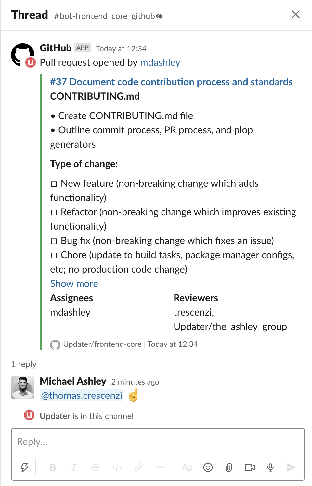

# Contributing

When contributing to this repository, please first discuss the change you wish to make via issue,
email, or any other method with the project owner before making a change.

<!-- TODO: Update Shortcut link with one that goes to a dedicated board for this repo -->

Most issues are first documented in [Shortcut](https://app.shortcut.com/updater) before being officially issued for work.

## Commit Process

In order to keep commits clean, readable and searchable, please adhere to the [Conventional Commits style guide](https://www.conventionalcommits.org/en/v1.0.0/#summary).

Commitizen has been configured to make adhering to conventional commits easy. To use commitizen, simply stage your files and run:

```bash
# yarn commit will run the commitizen prompt which will ask you to describe your change
# and then make a git commit that includes your staged files
yarn commit
```

## Pull Request Process

1. Request a review from at least two engineers.
2. Assign yourself to the pull request.
3. Merge the pull request once:
   - You have the sign-off of at least one other engineer
   - All required tests are passing
   - All comment threads have been resolved by the original commenter (see [Resolving Change Requests](#resolving-change-requests)).

### Notifying Reviewers

GitHub email notifications are not an efficient way to notify folks that their review has been requested on a pull request. We have set up the Slack channel #bot-frontend_core_github so manage these notifications.

Once you've opened a pull request, please create a thread on the message from the GitHub bot in Slack and tag the folks you assigned as reviewers.



We recommend muting this channel so that you are only alerted to explicity @ mentions. Please contact Thomas Crescenzi (thomas.crescenzi@updater.com) if you need to be added.

### Resolving Change Requests

Once you complete a change request, please reply to the comment thread with the corresponding commit number that resolves the request. It is the job of the person who made the change request to mark the comment thread as resolved (i.e., accept your change).


## Generators

This project uses [plop](https://github.com/plopjs/plop) to generate new files in a consistent manner.

To use it in interactive mode, run:

```bash
# plop interactive mode
$ yarn generate
```

You can also pass arguments directly. For example:

```bash
# create a new package
$ yarn generate package hello-world
```

The general format for this command is:

```bash
# plop generate template
$ yarn generate [generator] [name]
```

The following generators are supported (these are case-sensitive):

- `package`
- `component`

To add new generators or see details on how they are configured, see `plopfile.js`.

These generator templates are meant to be living documents that get updated over time to reflect the project's current preferred best practice for starting a new piece of code. If you have an idea on how to improve any of the templates, please open a PR! They are meant to be changed.
